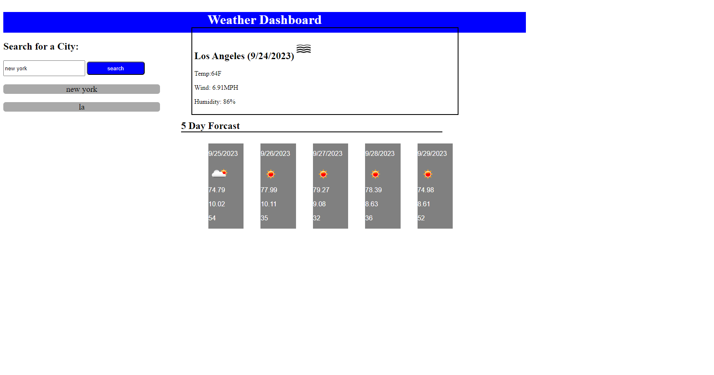

# Weather Dashbord

# Description
Ill be honest this would have been a lot more fun if i wasnt up against a wall, still the use of api calls was challenging.

## Installation
to insall this project, clone the repository from [github](https://github.com/b0n3yard/Fantastic_Weather_Dashboard) and open index.html in the chrome browser. alternatively you can view the finished page [here](https://b0n3yard.github.io/Fantastic_Weather_Dashboard/)

## Usage

## Credits
Michael Klein  
A lot of help from [W3schools](https://www.w3schools.com/js/default.asp) 
and a lot of advice from Skynet.

## Licence